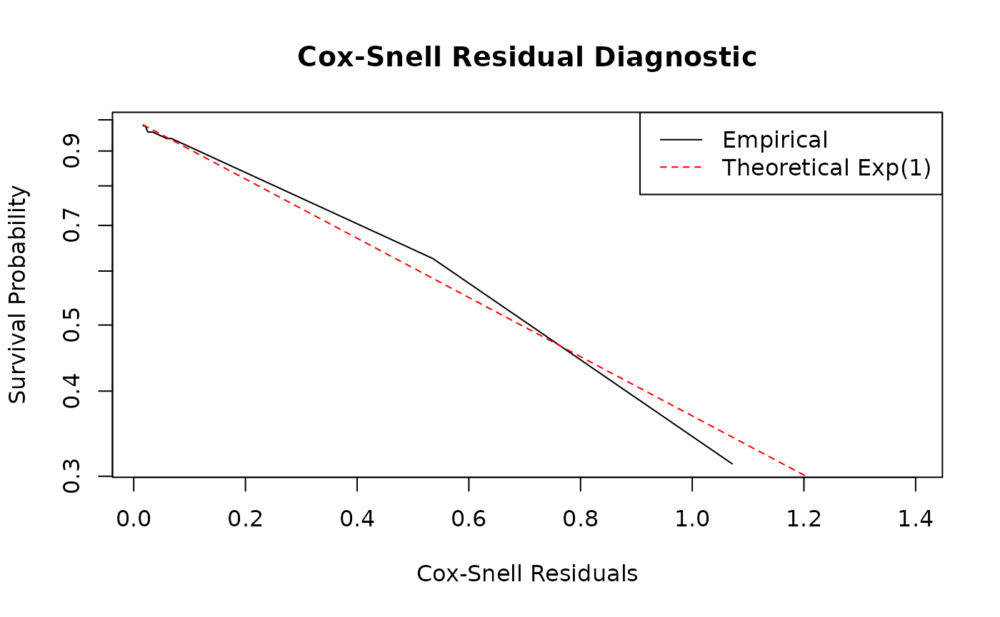

# Introduction to Durational Event Models

## Abstract

The **redeem** package provides tools for the estimation of **Durational
Event Models (DEM)** via the
[`dem()`](https://corneliusfritz.github.io/redeem/reference/dem.md)
function. This framework extends standard Relational Event Models (REM),
which can be fit using the
[`rem()`](https://corneliusfritz.github.io/redeem/reference/rem.md)
function, by explicitly modeling the duration of interactions. This
vignette provides a theoretical overview of the model and demonstrates
its application using a simulated dataset.

## Theoretical Framework

Unlike standard REMs that treat events as instantaneous, the DEM
framework characterizes interactions via two separate intensities:

1.  **Incidence Process (\\\lambda^{0\rightarrow 1}\\)**: Models the
    intensity of a pair of actors \\(i,j)\\ to start an interaction.
2.  **Dissolution Process (\\\lambda^{1\rightarrow 0}\\)**: Models the
    intensity of a pair of actors \\(i,j)\\ to end an already started
    interaction.

The intensities are modeled as: \\\lambda\_{ij}^{0\rightarrow 1}(t,
\beta, \alpha, \gamma^{0\rightarrow 1}) =
\exp(s\_{i,j}(\mathscr{H}\_t)^\top \beta + \alpha_i + \alpha_j + f(t,
\gamma^{0\rightarrow 1}))\\ \\\lambda\_{ij}^{1\rightarrow 0}(t, \delta,
\phi, \gamma^{1\rightarrow 0}) = \exp(u\_{i,j}(\mathscr{H}\_t)^\top
\delta + \phi_i + \phi_j + f(t, \gamma^{1\rightarrow 0}))\\

where:

- \\\mathscr{H}\_t\\ defines the history of interactions until time
  \\t\\.
- \\s\_{i,j}(\mathscr{H}\_t)\\ and \\u\_{i,j}(\mathscr{H}\_t)\\ are
  vectors of summary statistics.
- \\\alpha, \phi\\ are actor-specific popularity parameters.
- \\f(t, \gamma) = \sum\_{q=1}^Q \gamma_q \mathbb{I}(c\_{q-1} \le t \<
  c_q)\\ is a baseline step-function that captures temporal variations
  in the data. The indicator function \\\mathbb{I}(c\_{q-1} \le t \<
  c_q)\\ takes the value 1 if \\c\_{q-1} \le t \< c_q\\ and 0 otherwise,
  where \\0 = c_0 \< c_1 \< \dots \< c_Q\\ are specified change points
  and \\\gamma = (\gamma_1, \dots, \gamma_Q)^\top\\ is the baseline
  parameter vector (with \\\gamma_1 = 0\\ imposed for model
  identifiability). Note that here we only look at undirected
  interactions, so the parameters are symmetric for \\i\\ and \\j\\. The
  model is also implemented for directed interactions allowing for
  asymmetric parameters, i.e., with \\\phi\_{i,O}\\ and \\\phi\_{i,I}\\
  for the in and outgoing effect of actor \\i\\ in the dissolution
  intensity.

## Summary Statistics

The package implements several key statistics to capture network
dynamics. For full mathematical definitions and descriptions of the
available transformations (e.g., `log`, `sig`, `bin`), please refer to
the `redeem_terms` documentation.

Key terms include:

- **Inertia**: \\s\_{ij}(\mathscr{H}\_t) = N\_{ij}(t)\\, counting
  previous \\i \to j\\ formation events.
- **Degree Effects**: Actor-specific activity (\\\alpha\\) and
  popularity (\\\phi\\).
- **Duration**: For the dissolution process, the elapsed time since the
  beginning of the interaction.
- **Common Partners**: Shared outgoing (OSP) or incoming (ISP) friends.

## Fine-tuning with

The estimation process can be customized using the function. This
function creates a configuration object that manages algorithmic
behavior:

- **`estimate`**: Character; estimation method for (“Blockwise” or
  “NR”). “Blockwise” is the default and recommended for larger networks.
- **`it_max` & `tol`**: Integer and Numeric; maximum number of
  iterations and convergence tolerance. These can be given as a vector
  of length 2 to specify different limits for the formation (first
  element) and dissolution (second element) processes in .
- **`accelerated`**: Logical; if `TRUE`, uses SQUAREM acceleration for
  MM updates to speed up convergence. Can also be a vector of length 2
  for process-specific acceleration.
- **`verbose`**: Logical; if `TRUE`, prints iteration-specific progress.
- **`simultaneous_interactions`**: Logical; controls whether actors can
  participate in multiple interactions at once.
- **`return_data`**: Logical; whether to include preprocessed data
  frames in the result.

For example, to use more iterations for the dissolution process:

``` r

ctrl <- control.redeem(it_max = c(50, 200), tol = c(1e-8, 1e-12))
```

## Example: Simulating and Fitting a DEM

``` r

library(redeem)
```

### Data Preparation

A DEM event sequence contains durations encoded sequentially via
interaction states. The event matrix demands four columns: `time`,
`from`, `to`, and `type`. A `type = 1` transitions the dyad into an
active interaction, while `type = 0` dissolves it.

``` r

# Simulated continuous-duration interaction sequence
n_nodes <- 10
events <- matrix(c(
  1.0, 1, 2, 1, # Node 1 initiates tie with 2
  1.5, 3, 4, 1, # Node 3 initiates tie with 4
  2.0, 1, 2, 0, # Tie (1,2) concludes (duration 1.0)
  2.8, 3, 4, 0, # Tie (3,4) concludes (duration 1.3)
  3.5, 1, 3, 1, # Node 1 initiates tie with 3
  4.0, 1, 3, 0 # Tie (1,3) concludes (duration 0.5)
), ncol = 4, byrow = TRUE)
colnames(events) <- c("time", "from", "to", "type")
```

### Model Fitting

To estimate a DEM, utilize the
[`dem()`](https://corneliusfritz.github.io/redeem/reference/dem.md)
function, detailing unique structural formulas for the onset
(`formula_0_1`) and offset (`formula_1_0`) transition states. These
formulas are specified using the model terms documented in
`redeem_terms`.

``` r

# Fit the Durational Event Model
fit_dem <- dem(
  events = events,
  n_nodes = n_nodes,
  formula_0_1 = ~1, # Predictors for tie onset
  formula_1_0 = ~1, # Predictors for tie offset
  control = control.redeem(estimate = "Blockwise")
)

# View summaries using `summary.redeem_result`
summary(fit_dem)
#> Call:
#> dem(events = events, formula_0_1 = ~1, formula_1_0 = ~1, n_nodes = n_nodes, 
#>     control = control.redeem(estimate = "Blockwise"))
#> 
#> Results for Incidence Intensity (0 -> 1): 
#> Fixed Effects:
#>           Estimate Std. Error t value  Pr(>|t|)    
#> Intercept -4.07867    0.57734 -7.0646 1.611e-12 ***
#> ---
#> Signif. codes:  0 '***' 0.001 '**' 0.01 '*' 0.05 '.' 0.1 ' ' 1
#> 
#> Log-likelihood: -15.236 
#> 
#> Results for Duration Intensity (1 -> 0): 
#> Fixed Effects:
#>           Estimate Std. Error t value Pr(>|t|)
#> Intercept 0.068993   0.577349  0.1195   0.9049
#> 
#> Log-likelihood: -2.793 
#> 
#> Combined Model Fit:
#>   AIC: 40.05804 
#>   BIC: 40.45249 
#> 
#> Total estimation time: 0.008553743 secs
```

### Interpretation

- \\\beta\\ (**Incidence**): Positive parameters reflect an augmented
  intensity to create a network tie.
- \\\delta\\ (**Dissolution**): Positive parameters indicate an
  accelerated intensity to break a network tie (leading to *shorter*
  average interaction durations), while negative parameters identify
  ties structured to last considerably longer.

## Simulation and Model Diagnostics

Evaluating the final DEM allows you to guarantee that your dynamic
formulas correctly abstract the empirical interaction realities.

### Predicting and Simulating Events

Because the DEM explicitly represents the generative continuous-time
processes, calling the
[`simulate()`](https://rdrr.io/r/stats/simulate.html) method synthesizes
completely new behavioral pathways extrapolated from the estimated
parameters.

``` r

# Simulate networks matching the observed bounds
simulated_events <- simulate(fit_dem, nsim = 100, time_horizon = 10)
```

### Residual Analysis

To verify individual probabilistic predictions along the network
evolution, analyze the estimated intensity trajectories via **Cox-Snell
residuals**.

Upon formulating the predicted cumulative intensities up to the terminal
interaction lengths using the
[`predict()`](https://rdrr.io/r/stats/predict.html) method, the expected
cumulative intensities strictly conform to an \\Exp(1)\\ exponential
distribution if perfectly calibrated.

The **redeem** package provides the
[`get_residuals()`](https://corneliusfritz.github.io/redeem/reference/get_residuals.md)
function to automate this check. It calculates the cumulative
intensities for all dyads and returns Kaplan-Meier estimates of the
residual survival function alongside the theoretical \\Exp(1)\\ curve.

``` r

# Extract residuals for diagnostics using `get_residuals()`
# Note: Ensure return_data = TRUE was set in `control.redeem()`
resids <- get_residuals(fit_dem)

# Plot the Kaplan-Meier estimate of the residual survival vs. Theoretical Exp(1)
plot(resids$time, resids$surv,
  type = "l", log = "y",
  xlab = "Cox-Snell Residuals", ylab = "Survival Probability",
  main = "Cox-Snell Residual Diagnostic"
)
#> Warning in xy.coords(x, y, xlabel, ylabel, log): 1 y value <= 0 omitted from
#> logarithmic plot
lines(resids$time, resids$theoretical, col = "red", lty = 2)
legend("topright",
  legend = c("Empirical", "Theoretical Exp(1)"),
  col = c("black", "red"), lty = 1:2
)
```



If the model is accurately specified, the empirical survival curve
(black line) should closely follow the theoretical exponential decay
(red dashed line). Significant deviations, especially in the tails,
suggest that the model fails to capture certain temporal dynamics or
that there is unmodeled heterogeneity among dyads.

## References

Fritz, C., Rastelli, R., Fop, M., & Caimo, A. (2026). **Scalable
Durational Event Models: Application to Physical and Digital
Interactions**. *arXiv preprint arXiv:2504.00049*.
