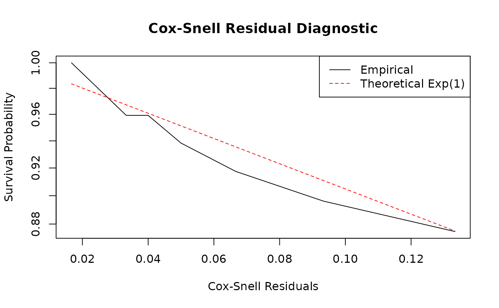

# Introduction to Relational Event Models

## Abstract

The **redeem** package provides tools for the scalable estimation of
continuous-time network models. While its primary focus is on models
that explicitly incorporate duration (Durational Event Models), the
framework natively supports standard **Relational Event Models (REM)**
for point-process interaction data via the
[`rem()`](https://corneliusfritz.github.io/redeem/reference/rem.md)
function. This vignette illustrates how to estimate REMs, interpret the
results, and evaluate model fit using simulated data.

## Theoretical Framework: Relational Event Models

A standard Relational Event Model (REM) conceptualizes social
interactions as instantaneous events in continuous time. It models a
stream of interactions between actors without associated durations
(e.g., sending an email, posting a tweet, or a discrete behavioral
action).

The generating mechanism of a REM is a multidimensional point process,
where each potential directed dyad \\(i,j)\\ has a distinct,
continuous-time intensity (or rate) of interaction:
\\\lambda\_{ij}(\mathscr{H}\_t, \beta, \alpha, \gamma) =
\exp(s\_{ij}(\mathscr{H}\_t)^\top \beta + \alpha_i + \alpha_j + f(t,
\gamma))\\

where:

- \\\mathscr{H}\_t\\ is the history of interactions up to time \\t\\.
- \\s\_{ij}(\mathscr{H}\_t)\\ is a vector of dynamic network statistics
  capturing the structural history of interactions up to time \\t\\.
- \\\beta\\ are the structural parameters governing these statistics.
- \\\alpha_i\\ and \\\alpha_j\\ are actor-specific baseline activity and
  popularity parameters (degree effects).
- \\f(t, \gamma) = \sum\_{q=1}^Q \gamma_q \mathbb{I}(c\_{q-1} \le t \<
  c_q)\\ is a baseline step-function that captures temporal variations
  in the overall intensity. The indicator function \\\mathbb{I}(c\_{q-1}
  \le t \< c_q)\\ takes the value 1 if \\c\_{q-1} \le t \< c_q\\ and 0
  otherwise, where \\0 = c_0 \< c_1 \< \dots \< c_Q\\ are specified
  change points and \\\gamma = (\gamma_1, \dots, \gamma_Q)^\top\\ is the
  baseline parameter vector (with \\\gamma_1 = 0\\ imposed for model
  identifiability).

## Summary Statistics and Degree Effects

The package implements several key statistics to capture network
dynamics. For full mathematical definitions and descriptions of the
available transformations (e.g., `log`, `sig`, `bin`), please refer to
the `redeem_terms` documentation.

When specifying a REM, it is crucial to balance structural network
statistics with actor-specific heterogeneity features:

- **Structural Effects**: Variables like **Inertia**
  (\\s\_{ij}(\mathscr{H}\_t) = N\_{ij}(t)\\) and **Common Partners**
  (shared coworkers or associates) capture complex endogenous
  dependencies reflecting the structural embedding of the network
  sequence.
- **Degree Effects (Actor Heterogeneity)**: Including sender
  (\\\alpha_i\\) and receiver (\\\alpha_j\\) degree effects is important
  to account for inherent individual activity. Omitting these degree
  effects often causes an omitted variable bias where structural
  parameter estimates artificially inflate to absorb underlying actor
  heterogeneity.
- **Temporal Effects**: Including terms that adapt to the baseline time
  accounts for non-stationarity in the overall intensity. Overlooking
  temporal fluctuations assumes all point occurrences are identically
  sequenced in exponential arrival gaps without burstiness or varying
  base density.

## Example: Simulating and Fitting a REM

Let’s simulate a basic relational event stream and fit a scalable REM.

``` r

library(redeem)
```

### Data Preparation

For a standard REM, the event sequence is represented as a matrix with
three main columns: `time`, `from`, and `to`. (If a `type` column is
present, standard REM treats all interactions as instantaneous events of
type 1).

``` r

# Simulated instantaneous event sequence
n_nodes <- 10
events <- matrix(c(
  1.0, 1, 2,
  1.5, 3, 4,
  2.0, 2, 1,
  2.8, 1, 3,
  3.5, 4, 3,
  4.0, 1, 4
), ncol = 3, byrow = TRUE)
colnames(events) <- c("time", "from", "to")
```

### Model Fitting

We estimate the REM using the
[`rem()`](https://corneliusfritz.github.io/redeem/reference/rem.md)
function. The model `formula` is specified using the model terms
documented in `redeem_terms`. In this simple example, we fit an
intercept-only model. Complex combinations of structural network
statistics and explicit node parameters can be mapped analogously.

``` r

# Fit the Relational Event Model
fit_rem <- rem(
  events = events,
  n_nodes = n_nodes,
  formula = ~1,
  control = control.redeem(estimate = "Blockwise")
)

# View summaries using `summary.redeem_result`
summary(fit_rem)
#> Call:
#> rem(events = events, formula = ~1, n_nodes = n_nodes, control = control.redeem(estimate = "Blockwise"))
#> 
#> Fixed Effects:
#>           Estimate Std. Error t value  Pr(>|t|)    
#> Intercept -3.40120    0.40825 -8.3312 < 2.2e-16 ***
#> ---
#> Signif. codes:  0 '***' 0.001 '**' 0.01 '*' 0.05 '.' 0.1 ' ' 1
#> 
#> Log-likelihood: -26.407 
#> 
#> Estimation time: 0.006642103 secs
```

### Interpretation

The estimated coefficients \\\beta\\ represent how the covariates
influence the incidence of instantaneous events. A positive coefficient
indicates that higher values of the corresponding statistic structurally
increase the rate at which \\(i, j)\\ interacts.

## Simulation and Model Diagnostics

Ensuring your estimated REM accurately reflects the observed data
involves rigorous simulation and residual checking tests against
continuous network evolution.

### Predicting and Simulating Events

The **redeem** package enables generating brand-new event networks using
the estimated parameters. Utilizing the
[`simulate()`](https://rdrr.io/r/stats/simulate.html) method on the
fitted object:

``` r

# Simulate networks from the fitted REM
simulated_events <- simulate(fit_rem, nsim = 100, time_horizon = 10)
```

Comparing networks generated from this simulation against your observed
data provides a holistic check. If macroscopic patterns (e.g., degree
distribution, inter-arrival times, sequence clustering) match
comprehensively, the model exhibits good structural and generating fit.

### Residual Analysis

To statistically diagnose the fit at the dyad level, you can assess the
model’s unobserved error using **Cox-Snell residuals**.

The concept relies on the property that if the specified intensity
\\\lambda\_{ij}(t)\\ is the true generating model, then the integrated
cumulative intensity computed up to the precise time of an observed
dyadic event will behave like a standard exponential random variable
\\Exp(1)\\.

The **redeem** package provides the
[`get_residuals()`](https://corneliusfritz.github.io/redeem/reference/get_residuals.md)
function to automate this check. It calculates the cumulative
intensities for all dyads and returns Kaplan-Meier estimates of the
residual survival function alongside the theoretical \\Exp(1)\\ curve.

``` r

# Extract residuals for diagnostics using `get_residuals()`
# Note: Ensure return_data = TRUE was set in `control.redeem()`
resids <- get_residuals(fit_rem)

# Plot the Kaplan-Meier estimate of the residual survival vs. Theoretical Exp(1)
plot(resids$time, resids$surv, type = "l", log = "y",
     xlab = "Cox-Snell Residuals", ylab = "Survival Probability",
     main = "Cox-Snell Residual Diagnostic")
lines(resids$time, resids$theoretical, col = "red", lty = 2)
legend("topright", legend = c("Empirical", "Theoretical Exp(1)"),
       col = c("black", "red"), lty = 1:2)
```



If the model is accurately specified, the empirical survival curve
(black line) should closely follow the theoretical exponential decay
(red dashed line). Significant deviations, especially in the tails,
suggest that the model fails to capture certain temporal dynamics or
that there is unmodeled heterogeneity among dyads.
